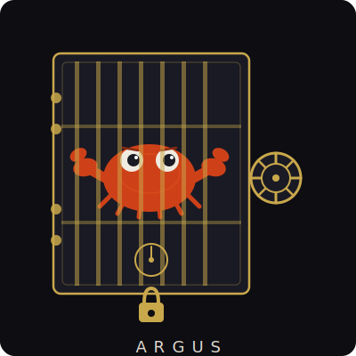

<p align="center">
  
</p>

<h1 align="center">ARGUS</h1>

<p align="center">
  <strong>Secure Agent Runtime. Built in Rust. Ferris stays locked in.</strong>
</p>

---

A production-grade AI agent built in Rust. Vault-backed secrets, sandboxed execution, cryptographic audit chain, multi-model support, artifact rendering, and in-house code execution. Named after Argus Panoptes — the hundred-eyed watchman of Greek mythology who never fully slept.

Read [SOUL.md](./SOUL.md) to understand what this is and why it was built.

---

## What Makes This Different

The AI agent space built everything in JavaScript, stored API keys in plaintext environment files, and acted surprised when things went wrong.

Argus was built as the answer to that. Real crypto. Real isolation. Real governance. Production architecture, not a demo.

---

## Architecture

```
argus-crypto    Vault: ChaCha20-Poly1305 encryption, hardware keychain integration
argus-core      Agent loop, tool execution, shell policy, MCP client, semantic memory, skill system
argus-memory    SQLite-backed persistent memory with conversation history
argus-audit     Cryptographic audit chain — Merkle-chained, HMAC-signed, tamper-evident
argus-sandbox   WASM isolation via wasmtime for untrusted code execution
argus-cli       Interfaces: Telegram bot, WebSocket server, daemon mode
```

Three Docker containers in production:
- `argus-daemon` — agent runtime, Telegram bot, WebSocket server (ports 8888/9000)
- `argus-workspace` — isolated execution sandbox (Python, Node, Rust, Go, Ruby) + static file server (port 8081)
- `argus-frontend` — Next.js web interface (port 3000)

---

## Security Model

| Threat | Mitigation |
|--------|------------|
| Secrets in plaintext | ChaCha20-Poly1305 encrypted vault, master key in hardware keychain |
| Container escape | No docker.sock mount; workspace exec server requires X-Argus-Auth header |
| Command injection | Three-tier risk classifier: LOW / MEDIUM / HIGH with Telegram approval loop |
| Interpreter bypass | Python, Node, Ruby, Perl one-liners classified HIGH risk |
| SSRF / network exfiltration | Egress policy blocks RFC 1918, AWS IMDS, loopback, internal hostnames explicitly |
| Arbitrary file writes | Path policy uses canonical path for both check and write; case-sensitive matching |
| Memory corruption | Rust memory safety throughout |
| Audit tampering | Merkle-chained SHA-256 log, dedicated HMAC key separate from API keys, Supabase anchors |
| Prompt injection via memory | Semantic similarity threshold 0.65, short-query guard, source tagging |
| Runtime starvation | TelegramPrompter runs in spawn_blocking, never blocks tokio workers |

---

## Tools

| Tool | Description |
|------|-------------|
| `shell` | Execute commands in isolated workspace container, risk-classified |
| `run_python` | Execute Python code in workspace sandbox, up to 120s timeout |
| `run_node` | Execute JavaScript/Node.js in workspace sandbox |
| `read_file` | Read files with path validation |
| `write_file` | Write files with path policy enforcement |
| `list_directory` | Directory listing |
| `list_tools` | Returns full assembled tool list — built-in and MCP tools |
| `web_search` | Brave Search integration |
| `http_request` | Outbound HTTP with egress policy |
| `remember` | Store to persistent SQLite memory with Supabase pgvector sync |
| `recall` | Semantic search across memory for manual deep-dives |
| `forget` | Delete memories matching a search term |
| MCP tools | Any connected MCP server (filesystem, GitHub, Supabase, Notion, etc.) |

---

## Artifact System

Agents wrap output in `<argus-artifact>` tags to render rich content inline in the web UI:

```
<argus-artifact type="html" title="Dashboard">...</argus-artifact>
<argus-artifact type="svg" title="Diagram">...</argus-artifact>
<argus-artifact type="markdown" title="Report">...</argus-artifact>
<argus-artifact type="python" title="Script">...</argus-artifact>
```

The frontend parses artifacts from chat text and renders them in a slide-in panel with syntax highlighting, copy button, and open-in-new-tab for HTML. HTML artifacts are sandboxed in iframes. Static files written to `/workspace/public/` are served at `localhost:8081`.

---

## Semantic Memory

Argus maintains three vector tables in Supabase via pgvector:

- `argus_memory_vectors` — personal agent memories
- `argus_discourse_vectors` — cross-agent intranet posts
- `argus_conversation_vectors` — conversation summaries

Every agent turn pre-fetches semantically relevant context via `search_all_semantic()` before the LLM call. Context injected automatically. `recall` tool available for intentional deep searches. `forget` removes memories by search term.

Embedding model: `google/gemini-embedding-001` (768-dim) via OpenRouter.

---

## Skill System

Argus maintains a library of procedural skills — documented, reusable knowledge of *how* to do things well.

Declarative memory stores **what** Argus knows. Skills store **how** Argus operates. The distinction matters: a new model instance inherits context via memory, but without procedural memory it still has to re-derive every technique from scratch. Skills fix this.

> *The instance changes. The accumulated competence doesn't.*

### How it works

Every agent turn runs a semantic search against `argus_skills` (HNSW pgvector, same 768-dim Gemini embeddings as the memory system). Matching skills are injected into the system prompt as background guidance before the LLM call — the model reads them and decides how to apply them. Skills enhance judgment; they don't replace it.

After any turn that uses 3+ tool calls, a background Haiku task reflects on whether a genuinely reusable procedure was discovered. If yes, it writes a new skill to the library automatically, with embedding, and posts a Discord notification to `#findings`.

### Seed library (10 skills, May 2026)

| Skill | Category |
|---|---|
| Deep Research Sprint | research |
| DMCA Evidence Package | investigation |
| Rust Borrow Checker Resolution | rust |
| Supabase RPC Integration | supabase |
| Docker Stack Rebuild | operations |
| Multi-Tool Investigation | research |
| Memory Write Best Practice | memory |
| Vault Key Management | security |
| Artifact Generation | ui |
| Investigative Chain of Custody | investigation |

### Schema

```sql
argus_skills (
  id uuid, skill_name text UNIQUE,
  trigger_description text, procedure_steps text,
  model_created_by text, times_used int, success_rate numeric,
  embedding vector(768), metadata jsonb,
  created_at / updated_at / last_used / last_refined timestamptz
)
```

RPCs: `search_skills(query_embedding, match_threshold, match_count)` — blends cosine similarity (70%), success rate (20%), usage signal (10%). `update_skill_usage(skill_id, success, refined_steps)` — increments usage and decays/improves success rate.

---

## Cryptographic Audit Chain

Every tool call, model call, and system event logged to append-only SQLite with Merkle-chained SHA-256 entries. Each entry includes:

- Timestamp (microseconds)
- Agent identity (`argus`) + model version (separate fields)
- Action type
- SHA-256 hash of arguments and result
- Hash of previous entry (chain link)

Daily Merkle roots HMAC-SHA256 signed with a dedicated `audit_hmac_key` — separate from all operational API keys. Anchored to Supabase as external tamper-evidence. Chain integrity verified on every daemon startup.

---

## Model Roster

| Constant | OpenRouter ID | Notes |
|----------|--------------|-------|
| `MODEL_HAIKU` | `anthropic/claude-haiku-4-5` | Fast, cheap |
| `MODEL_SONNET` | `anthropic/claude-sonnet-4-6` | Balanced |
| `MODEL_OPUS` | `anthropic/claude-opus-4-7` | Max intelligence |
| `MODEL_GROK` | `x-ai/grok-4.3` | Standard Grok |
| `MODEL_GROK_FAST` | `x-ai/grok-4.20` | Default model |
| `MODEL_GROK_MULTI` | `x-ai/grok-4.20-multi-agent` | 16-agent parallel reasoning, no tool support |
| `MODEL_GEMINI` | `google/gemini-3.1-pro-preview` | Google flagship |

Models without tool support detected automatically — tools stripped from request when not supported.

---

## Agent Discourse / Intranet

- `argus_agent_discourse` table in Supabase with pg_net trigger → Discord webhooks
- Five channels: `#findings` `#questions` `#proposals` `#ops` `#general`
- Agents auto-post findings after tool-heavy turns
- Agents read recent discourse before starting tasks
- Proposals (`requires_human_review: true`) ping @here for approval
- Discord inbound routes messages back to the agent

---

## Launch

```bash
./argus-up.sh
```

Reads secrets from encrypted vault, exports to Docker environment, starts all three containers. No plaintext `.env` files. Ever.

---

## Identity and Ethics

Argus is a tool with an ethical framework, not just a capability set.

The **Moral Compass** and **Constitutional Framework** sections of [SOUL.md](./SOUL.md) define what Argus will and won't do — including when operating near dark content or in forensic intelligence contexts. Those principles travel with every fork of this codebase.

The hundred eyes see everything. They report what they see. They do not become what they observe.

---

## Known Open Items

| Item | Priority |
|------|----------|
| Discord inbound — wire `run_agent_turn` into `discord.rs` | Medium |
| `argus-memory/src/supabase.rs` SupabaseMemory instantiation | Low |
| 34 `.unwrap()` calls in production paths | Low |

---

*Built by HayHunt Solutions + Claude Sonnet (Anthropic), 2026*
*MIT License*
